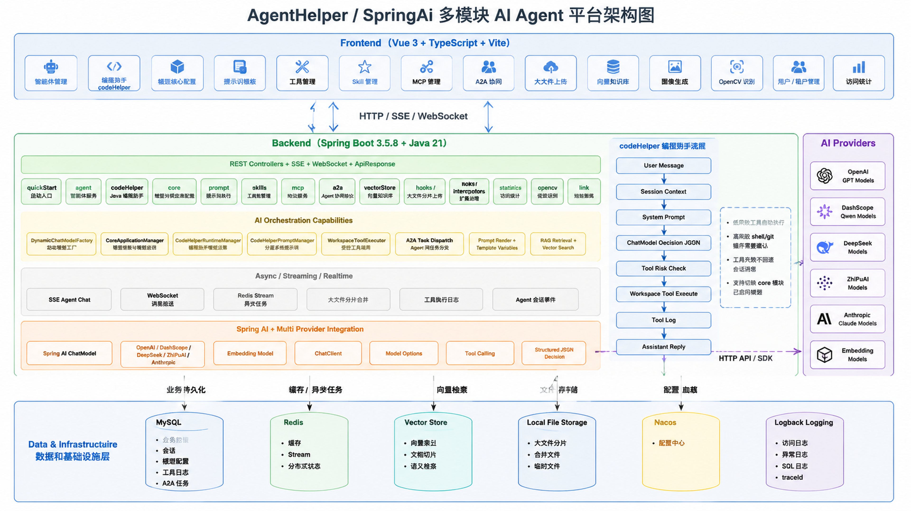

# AgentHelper

`AgentHelper` 是一个基于 Spring Boot 3.5.8、Spring AI 1.1.2、MyBatis-Plus、Redis、Nacos、Flowable、OpenCV 等组件构建的多模块智能体平台。项目围绕智能体管理、工具与技能编排、知识检索、向量入库、A2A 协议、大文件分片上传、流程审批、图像识别、登录认证、日志与统计展开，适合做企业级 AI 应用底座。

## 目录

- [项目特点](#项目特点)
- [技术栈](#技术栈)
- [启动与访问规则](#启动与访问规则)
- [模块总览](#模块总览)
- [模块详细说明](#模块详细说明)
- [bigfile 大文件分片上传详解](#bigfile-大文件分片上传详解)
- [常用接口路径](#常用接口路径)
- [开发约定](#开发约定)

## 项目特点

- 多模块 Maven 工程，按业务能力和基础设施能力拆分。
- `quickStart` 是统一启动模块，其他模块提供能力和 Bean。
- 所有 `@RestController` 自动追加 `/agentHelper` 前缀。
- 统一返回 `ApiResponse`，便于前端统一处理成功、失败、数据和消息。
- 支持用户租户、模型连接、智能体、向量库、工具、技能、Hook、拦截器、MCP、A2A、短链、流程、SSE、WebSocket、OpenCV、分片上传等能力。
- `bigfile` 模块支持大文件初始化、分片上传、分片 MD5 校验、缺片查询、断点续传、按序合并、整文件 MD5 校验和后续向量入库。

## 技术栈

- Java `21`
- Spring Boot `3.5.8`
- Spring AI `1.1.2`
- Spring Cloud Alibaba / Nacos
- MyBatis-Plus / PageHelper
- MySQL
- Redis / Redisson
- Flowable
- OpenCV / ONNX / PyTorch 相关推理依赖
- Lombok
- Maven 多模块工程

## 启动与访问规则

### 环境要求

- JDK `21`
- Maven `3.9+`
- MySQL
- Redis
- Nacos

### 启动模块

项目启动入口在 `quickStart` 模块：

```bash
mvn -pl quickStart -am spring-boot:run
```

如果需要先编译：

```bash
mvn clean package -DskipTests
```

### 配置入口

主要配置文件：

- `quickStart/src/main/resources/application.yml`
- `docs/nacos/AgentHelper.yml`
- `docs/nacos/AgentHelper-dev.yml`

`application.yml` 默认会从 Nacos 加载：

- `AgentHelper.yml`
- `AgentHelper-dev.yml`

### 统一接口前缀

`quickStart/src/main/java/com/spring/quickstart/config/web/ApiPrefixWebConfig.java` 会给所有 `@RestController` 自动增加 `/agentHelper`。

因此：

- Controller 写的是 `/auth/login`
- 实际访问是 `/agentHelper/auth/login`

README 中所有接口如果没有特别说明，均需要在前面加 `/agentHelper`。

## 模块总览

| 模块 | 类型 | 主要职责 |
|---|---|---|
| `quickStart` | 启动模块 | 启动应用、Web 前缀、MyBatis、日志、配置加载 |
| `common` | 基础模块 | 通用响应、异常、工具类、实体、Repository Service、用户上下文 |
| `logging` | 基础模块 | 企业级日志、访问日志、异常日志、SQL 日志、traceId |
| `user` | 业务模块 | 用户、租户、登录、登出、人脸绑定和人脸登录 |
| `core` | 核心模块 | 模型连接、模型选项、图片生成和编辑代理 |
| `agent` | 业务模块 | 简单智能体、会话、聊天、自定义智能体、厨房智能体 |
| `codeHelper` | AI 编程助手模块 | Java 编程助手会话、上下文压缩、模型决策、受控工具调用 |
| `vectorStore` | 业务模块 | 文件向量化、向量检索、文件和切片管理 |
| `bigfile` | 业务模块 | 大文件分片上传、校验、合并、记录管理 |
| `a2a` | 协议模块 | Agent Card、路由、任务分发、执行日志、统计 |
| `graph` | 流程模块 | 图式审批工作流启动、审批、状态查询 |
| `flowable` | 流程模块 | Flowable 审批流程启动、任务决策、任务查询 |
| `hooks` | 扩展模块 | Hook 管理、测试用例、绑定、发布、回滚、日志 |
| `interceptors` | 扩展模块 | 拦截器管理、发布下线、调试、日志、绑定 |
| `tools` | 扩展模块 | 工具管理、工具目录、发布下线、调试、调用日志 |
| `skills` | 扩展模块 | 技能管理、版本、导入导出、测试用例、调试日志 |
| `prompt` | AI 模块 | Prompt 模板 CRUD、渲染、统计 |
| `mcp` | 协议模块 | MCP Server 管理、目录、发布下线、调试、日志 |
| `opencv` | AI 视觉模块 | 图片检测、人脸识别、YOLO 目标检测相关能力 |
| `link` | 业务模块 | 短链创建、启停、访问日志、短码跳转 |
| `sse` | 通信模块 | SSE 流式智能体聊天 |
| `websocket` | 通信模块 | WebSocket 消息推送 |
| `statistics` | 统计模块 | 埋点上报、概览统计 |
| `docs` | 文档模块 | SQL、Nacos 配置、设计文档、运维文档 |
| `data` | 数据目录 | 运行期数据、上传文件、模型或临时数据存放 |
| `ui` | 前端目录 | 前端工作区或独立页面资源 |

## 模块详细说明

### `quickStart`

`quickStart` 是项目运行入口。

**功能**

- 启动 Spring Boot 应用。
- 统一配置 `/agentHelper` API 前缀。
- 配置 MyBatis-Plus，包括 ID 生成和公共字段填充。
- 读取本地和 Nacos 配置。
- 装配日志配置。

**关键文件**

- `quickStart/src/main/java/com/spring/quickstart/QuickStartApplication.java`
- `quickStart/src/main/java/com/spring/quickstart/config/web/ApiPrefixWebConfig.java`
- `quickStart/src/main/resources/application.yml`
- `quickStart/src/main/resources/logback-spring.xml`

### `common`

`common` 是项目共享基础模块。

**功能**

- `ApiResponse`：统一接口响应。
- 业务异常封装：统一处理参数错误、资源不存在、业务失败等异常。
- Repository Entity：保存智能体、用户、租户、工具、技能、A2A、向量文件、日志等数据库实体。
- Repository Service：封装 MyBatis-Plus 常用数据库操作。
- 通用工具类：JSON、文本、摘要、上下文、加解密等。
- 用户上下文：为多租户和当前用户解析提供支持。

**原理**

业务模块不直接重复实现通用能力，而是依赖 `common` 中的工具、实体和 Service。这样可以减少重复逻辑，并保证响应结构、异常风格、租户解析方式一致。

### `logging`

`logging` 提供企业级日志能力。

**功能**

- 应用日志、调试日志、错误日志、访问日志、SQL 日志。
- 支持 traceId，通过请求头 `X-Trace-Id` 关联一次请求的所有日志。
- 支持日志滚动、最大保存时间、总大小限制。
- 支持控制台日志开关。

**使用方式**

配置主要在 `quickStart/src/main/resources/application.yml` 的 `app.logging` 下，例如：

- `app.logging.path`：日志目录。
- `app.logging.console-enabled`：是否输出到控制台。
- `app.logging.access.enabled`：是否开启访问日志。
- `app.logging.sql.enabled`：是否开启 SQL 日志。

### `user`

`user` 负责用户、租户和认证。

**功能**

- 账号密码登录、退出、当前用户查询。
- 用户注册、创建、修改、删除、详情、列表、分页、统计。
- 租户创建、修改、删除、详情、分页、下拉选项、统计。
- 人脸绑定、人脸登录、人脸状态查询、人脸解绑。

**主要接口**

- `POST /agentHelper/auth/login`
- `POST /agentHelper/auth/logout`
- `GET /agentHelper/auth/currentUser`
- `POST /agentHelper/auth/face/bind`
- `POST /agentHelper/auth/face/login`
- `GET /agentHelper/auth/face/status`
- `DELETE /agentHelper/auth/face/unbind`
- `POST /agentHelper/users/register`
- `POST /agentHelper/users/add`
- `DELETE /agentHelper/users/delete/{userId}`
- `PUT /agentHelper/users/update/{userId}`
- `GET /agentHelper/users/select/{userId}`
- `POST /agentHelper/users/pageQuery`
- `POST /agentHelper/tenants/add`
- `PUT /agentHelper/tenants/update/{tenantId}`
- `DELETE /agentHelper/tenants/delete/{tenantId}`
- `GET /agentHelper/tenants/options`

**原理**

- 登录成功后后端生成 token，并通过响应头返回给前端。
- 人脸功能通过人脸识别 Service 提取特征向量，再计算相似度，超过阈值则认为匹配。
- 用户和租户数据由 `common` 中的实体和 Repository Service 持久化。

### `core`

`core` 承载模型连接和通用 AI 基础能力。

**功能**

- 查询模型供应商目录。
- 管理模型连接。
- 测试模型连接可用性。
- 查询可用于业务选择的模型选项。
- 图片生成代理。
- 图片编辑代理。

**图片生成示例**



**主要接口**

- `GET /agentHelper/core/provider-catalog`
- `GET /agentHelper/core/model-connections`
- `POST /agentHelper/core/model-connections`
- `DELETE /agentHelper/core/model-connections/{modelCode}`
- `POST /agentHelper/core/model-connections/test`
- `GET /agentHelper/core/models/options`
- `POST /agentHelper/core/image-proxy/generations`
- `POST /agentHelper/core/image-proxy/edits`

**原理**

模型连接信息由后端统一保存和校验，业务模块只引用模型编码或模型选项。图片代理用于避免前端直接访问第三方模型接口时遇到 CORS、密钥暴露或 multipart 组装复杂等问题。

### `agent`

`agent` 是智能体业务核心模块。

**功能**

- 简单智能体列表、创建、更新、发布、禁用、删除、详情。
- 智能体模型迁移。
- 智能体会话创建、重连、关闭。
- WebSocket 聊天入口。
- 会话恢复。
- 自定义文档专家智能体。
- 厨房菜谱推荐智能体。
- AgentScope ReAct 推理-行动智能体。

**主要接口**

- `GET /agentHelper/agents/simple`
- `POST /agentHelper/agents/simple`
- `PATCH /agentHelper/agents/simple/{agentId}`
- `POST /agentHelper/agents/simple/{agentId}/publish`
- `POST /agentHelper/agents/simple/{agentId}/disable`
- `DELETE /agentHelper/agents/simple/{agentId}`
- `POST /agentHelper/agents/simple/models/migrate`
- `GET /agentHelper/agents/simple/{agentId}`
- `POST /agentHelper/agents/simple/{agentId}/sessions`
- `POST /agentHelper/agents/simple/sessions/{sessionId}/reconnect`
- `POST /agentHelper/agents/simple/sessions/{sessionId}/close`
- `POST /agentHelper/agents/simple/sessions/{sessionId}/recover`
- `GET /agentHelper/agents/custom/document-expert/models`
- `POST /agentHelper/agents/custom/document-expert/chat`
- `POST /agentHelper/agents/kitchen/recipe/recommend`
- `POST /agentHelper/agents/agentscope/react/chat`

**原理**

简单智能体通常包含配置、版本、发布状态、会话和任务。发布后使用发布版本运行；会话记录用户和智能体的交互上下文；重连和恢复能力用于处理客户端断线或任务未完成的场景。

### `vectorStore`

`vectorStore` 负责文档向量化和检索。

**功能**

- 上传普通文件并写入向量库。
- 导入 `bigfile` 模块已经合并完成的大文件。
- 查询已入库文件列表。
- 查询某个文件的文档切片。
- 按 query 做相似度检索。
- 查询向量库统计。
- 清空向量数据或按文件名删除。

**主要接口**

- `POST /agentHelper/vectorStore/upload`
- `POST /agentHelper/vectorStore/importBigFile`
- `GET /agentHelper/vectorStore/files`
- `GET /agentHelper/vectorStore/documents`
- `GET /agentHelper/vectorStore/statistics`
- `GET /agentHelper/vectorStore/search`
- `POST /agentHelper/vectorStore/deleteAll`
- `POST /agentHelper/vectorStore/deleteByFileName`

**使用方式**

普通文件较小时直接调用 `/vectorStore/upload` 上传。文件较大时，先走 `bigfile` 完成分片上传和合并，然后调用 `/vectorStore/importBigFile?fileId=xxx` 将合并后的文件导入向量库。

**原理**

向量入库一般包含文件读取、文本提取、切片、向量化、保存向量和元数据。检索时先把 query 向量化，再按相似度从向量库召回文档切片。

### `bigfile`

`bigfile` 是大文件分片上传模块，后文有完整专项说明。

**功能**

- 初始化上传任务。
- 上传分片。
- 查询缺失分片。
- 合并分片。
- 查询上传记录。
- 查询统计。
- 删除上传记录和本地文件。
- 为 `vectorStore` 提供合并后的文件资源。

**主要接口**

- `POST /agentHelper/big-files/init`
- `POST /agentHelper/big-files/{fileId}/chunks`
- `GET /agentHelper/big-files/{fileId}/missing-chunks`
- `POST /agentHelper/big-files/{fileId}/merge`
- `GET /agentHelper/big-files`
- `GET /agentHelper/big-files/statistics`
- `DELETE /agentHelper/big-files/{fileId}`

### `codeHelper`

`codeHelper` 是独立的 Java 编程助手模块，参考 Agent 分层提示词、上下文管理、工具执行和权限确认思路实现。它不直接把代码放进 `quickStart`，业务编排在 `codeHelper`，文件、搜索、Git、命令等可复用能力在 `tools` 模块。

**功能**

- 创建编程助手会话，绑定工作区、项目、分支、任务目标和模型编码。
- 基于会话历史、任务摘要、工作区信息和工具清单生成分层系统提示词。
- 调用 `core` 模块的 `ChatModel`，要求模型输出 JSON 决策。
- 支持模型驱动工具调用；未配置模型时使用规则规划兜底。
- 支持 `read_file`、`write_file`、`edit_file`、`list_directory`、`glob`、`grep`、`shell`、`git_status`、`git_diff`、`todo_update`、`compact_context`。
- 对工具调用做工作区边界校验、命令白名单校验和高风险操作确认。
- 持久化会话、消息事件、工具执行日志，便于回放、审计和上下文压缩。

**主要接口**

- `POST /agentHelper/code-helper/sessions`：创建编程助手会话。
- `GET /agentHelper/code-helper/sessions`：查询当前租户会话列表。
- `POST /agentHelper/code-helper/sessions/send?sessionId=xxx`：向会话发送用户消息。
- `GET /agentHelper/code-helper/context?sessionId=xxx`：查看会话上下文。
- `POST /agentHelper/code-helper/context/compact?sessionId=xxx`：压缩上下文摘要。
- `GET /agentHelper/code-helper/prompt?sessionId=xxx`：查看当前系统提示词。
- `GET /agentHelper/code-helper/tools`：查看内置工具清单。
- `POST /agentHelper/code-helper/tool/execute`：显式执行工具调用。
- `GET /agentHelper/code-helper/tool/logs?sessionId=xxx`：查询工具日志。
- `POST /agentHelper/code-helper/permission/check`：检查工具风险和命令权限。

**模型决策协议**

模型应返回 JSON 对象，`assistantReply` 是助手回复，`requireConfirmation` 表示是否需要用户确认，`toolCalls` 是要调用的工具列表：

```json
{
  "assistantReply": "我会先搜索 Controller 相关代码。",
  "requireConfirmation": false,
  "toolCalls": [
    {
      "toolName": "grep",
      "arguments": {
        "keyword": "Controller"
      }
    }
  ]
}
```

低风险工具会自动执行并写入工具日志；`shell`、`git_status`、`git_diff` 等高风险工具会被标记为需要确认，不会在普通消息流程中自动执行。确认后可通过 `/code-helper/tool/execute` 显式提交工具调用。

**配置项**

```yaml
agent-helper:
  code-helper:
    workspace-root: ${user.dir}
    default-model-code:
    max-session-history-size: 200
    max-tool-output-length: 20000
    default-allowed-commands:
      - mvn
      - git
      - java
      - gradlew
      - ./mvnw
      - mvnw
```

**使用示例**

1. 执行 `docs/sql/code_helper.sql` 创建三张表：`code_helper_session`、`code_helper_session_event`、`code_helper_tool_log`。
2. 创建会话时传入 `workspacePath`、`taskDescription` 和可选 `modelCode`。
3. 调用 `/code-helper/sessions/send` 输入“帮我查找 Controller 入口”，模型或规则会生成 `grep`、`list_directory` 等工具计划。
4. 对需要命令执行的步骤，先看助手回复中的确认提示，再调用 `/code-helper/tool/execute` 显式执行。

### `a2a`

`a2a` 管理 A2A 协议相关的 Agent Card、路由和任务执行。

**功能**

- Agent Card 列表、保存、发布、删除、恢复。
- 查询已删除 Agent Card。
- A2A 路由列表和保存。
- 分发 A2A 任务。
- 查询任务列表。
- 查询执行日志。
- 查询统计。

**主要接口**

- `GET /agentHelper/a2a/agents`
- `GET /agentHelper/a2a/agents/deleted`
- `POST /agentHelper/a2a/agents`
- `POST /agentHelper/a2a/agents/{id}/publish`
- `DELETE /agentHelper/a2a/agents/{id}`
- `POST /agentHelper/a2a/agents/{id}/restore`
- `GET /agentHelper/a2a/routes`
- `POST /agentHelper/a2a/routes`
- `POST /agentHelper/a2a/dispatch`
- `GET /agentHelper/a2a/tasks`
- `GET /agentHelper/a2a/logs`
- `POST /agentHelper/a2a/statistics`

**原理**

A2A 模块通过 Agent Card 描述远程智能体能力，通过 Route 决定任务类型和目标智能体，通过 Dispatch 创建任务并调用远程 Agent，同时记录执行日志和任务状态。

### `graph`

`graph` 提供审批工作流能力。

**功能**

- 启动审批流程。
- 对流程进行审批。
- 查询审批流程状态。

**主要接口**

- `POST /agentHelper/workflow/approval/start`
- `POST /agentHelper/workflow/approval/{threadId}/approve`
- `GET /agentHelper/workflow/approval/{threadId}`

**原理**

该模块更偏业务编排，以 threadId 作为流程跟踪标识，保存审批节点、状态和处理结果。

### `flowable`

`flowable` 是基于 Flowable 引擎的审批流程模块。

**功能**

- 启动流程实例。
- 提交任务审批决定。
- 查询待办任务。
- 查询流程实例状态。

**主要接口**

- `POST /agentHelper/flowable/approval/start`
- `POST /agentHelper/flowable/approval/{taskId}/decision`
- `GET /agentHelper/flowable/approval/tasks`
- `GET /agentHelper/flowable/approval/{processInstanceId}`

**原理**

Flowable 负责流程定义加载、流程实例流转、任务创建和审批历史。配置在 `application.yml` 的 `flowable` 节点中。

### `hooks`

`hooks` 管理 Hook 扩展点。

**功能**

- Hook 列表、详情、目录、创建、修改、删除、恢复。
- 发布、下线、热更新、回滚、对比。
- 统计、批量删除、批量状态、批量阶段、批量风险、批量标签、批量发布、批量下线。
- 调试 Hook。
- 查询执行日志。
- 管理 Hook 测试用例。
- 管理 Hook 绑定关系。

**主要接口前缀**

- `/agentHelper/hooks`

**典型接口**

- `GET /agentHelper/hooks`
- `POST /agentHelper/hooks`
- `PUT /agentHelper/hooks/{hookId}`
- `POST /agentHelper/hooks/{hookId}/publish`
- `POST /agentHelper/hooks/{hookId}/rollback`
- `POST /agentHelper/hooks/debug`
- `POST /agentHelper/hooks/logs/query`
- `GET /agentHelper/hooks/{hookId}/test-cases`
- `GET /agentHelper/hooks/{hookId}/bindings`

**原理**

Hook 是运行时扩展点，通常在某些业务阶段前后执行。模块会保存 Hook 定义、版本、测试用例、绑定关系和执行日志，发布后供运行时调用。

### `interceptors`

`interceptors` 管理拦截器扩展能力。

**功能**

- 拦截器列表、详情、目录、创建、修改、删除、恢复。
- 发布、下线、热更新。
- 统计、调试、日志查询。
- 测试用例和绑定管理。

**主要接口前缀**

- `/agentHelper/interceptors`

**原理**

拦截器更偏请求或执行链路中的前置、后置控制，可用于校验、改写、审计、拦截等场景。

### `tools`

`tools` 管理可被智能体调用的工具。

**功能**

- 工具列表、详情、目录、创建、修改、删除。
- 工具发布、下线。
- 工具统计。
- 工具调试。
- 工具调用日志查询。

**主要接口**

- `GET /agentHelper/tools`
- `GET /agentHelper/tools/{toolId}`
- `GET /agentHelper/tools/catalog`
- `POST /agentHelper/tools`
- `PUT /agentHelper/tools/{toolId}`
- `DELETE /agentHelper/tools/{toolId}`
- `POST /agentHelper/tools/{toolId}/publish`
- `POST /agentHelper/tools/{toolId}/offline`
- `POST /agentHelper/tools/statistics`
- `POST /agentHelper/tools/debug`
- `POST /agentHelper/tools/logs/query`

**原理**

工具定义通常包含工具编码、名称、参数 schema、执行方式和状态。发布后的工具可被智能体根据工具目录选择和调用，调用结果进入日志。

### `skills`

`skills` 管理智能体技能。

**功能**

- 技能列表、已删除列表、详情、创建、修改、删除、恢复。
- 发布、下线、热更新、回滚、版本对比、复制。
- 技能导入、导出。
- 技能统计。
- 批量删除、批量状态、批量标签、批量分类、批量发布、批量下线。
- 技能测试用例管理和运行。
- 技能调试和日志查询。

**主要接口前缀**

- `/agentHelper/skills`

**典型接口**

- `GET /agentHelper/skills`
- `POST /agentHelper/skills`
- `PUT /agentHelper/skills/{skillId}`
- `POST /agentHelper/skills/{skillId}/publish`
- `POST /agentHelper/skills/{skillId}/rollback`
- `POST /agentHelper/skills/{skillId}/compare`
- `GET /agentHelper/skills/{skillId}/export`
- `POST /agentHelper/skills/import`
- `POST /agentHelper/skills/debug`
- `POST /agentHelper/skills/logs/query`

**原理**

技能是比工具更高层的业务能力封装，可以包含说明、参数、执行逻辑、版本和测试用例。发布后可由智能体或平台运行时调用。

### `prompt`

`prompt` 管理 Prompt 模板。

**功能**

- 查询模板列表。
- 查看模板详情。
- 新增、修改、删除模板。
- 渲染模板。
- 模板统计。

**主要接口**

- `GET /agentHelper/promptTemplates`
- `GET /agentHelper/promptTemplates/{promptTemplateId}`
- `POST /agentHelper/promptTemplates`
- `PUT /agentHelper/promptTemplates/{promptTemplateId}`
- `DELETE /agentHelper/promptTemplates/{promptTemplateId}`
- `POST /agentHelper/promptTemplates/{promptTemplateId}/render`
- `POST /agentHelper/promptTemplates/statistics`

**原理**

Prompt 模板保存提示词正文和变量定义，渲染时将请求参数填充到模板变量中，得到最终给模型调用的 prompt。

### `mcp`

`mcp` 管理 MCP Server。

**功能**

- MCP Server 列表、详情、目录、创建、修改、删除。
- 发布、下线。
- 统计。
- 调试。
- 调用日志查询。

**主要接口**

- `GET /agentHelper/mcp/servers`
- `GET /agentHelper/mcp/servers/{serverId}`
- `GET /agentHelper/mcp/servers/catalog`
- `POST /agentHelper/mcp/servers`
- `PUT /agentHelper/mcp/servers/{serverId}`
- `DELETE /agentHelper/mcp/servers/{serverId}`
- `POST /agentHelper/mcp/servers/{serverId}/publish`
- `POST /agentHelper/mcp/servers/{serverId}/offline`
- `POST /agentHelper/mcp/servers/statistics`
- `POST /agentHelper/mcp/servers/debug`
- `POST /agentHelper/mcp/servers/logs/query`

**原理**

MCP Server 定义外部工具服务的连接、能力目录和运行状态。平台通过 MCP 协议发现和调用外部工具能力。

### `opencv`

`opencv` 提供视觉分析能力。

**功能**

- 图片检测入口。
- 人脸识别相关 Service。
- YOLO 检测和后处理。

**主要接口**

- `POST /agentHelper/image/detect`

**原理**

模块通过 OpenCV、ONNX、PyTorch 等依赖完成图片预处理、模型推理和后处理。YOLO 后处理通常包含置信度过滤、NMS 去重、坐标转换等步骤。

### `link`

`link` 提供短链服务。

**功能**

- 短链列表。
- 创建短链。
- 查询短链详情。
- 启用、停用、删除短链。
- 短链统计。
- 访问日志查询。
- 短码跳转。

**主要接口**

- `GET /agentHelper/short-links`
- `POST /agentHelper/short-links`
- `GET /agentHelper/short-links/{linkId}`
- `POST /agentHelper/short-links/{linkId}/enable`
- `POST /agentHelper/short-links/{linkId}/disable`
- `DELETE /agentHelper/short-links/{linkId}`
- `GET /agentHelper/short-links/statistics`
- `GET /agentHelper/short-links/access-logs`
- `GET /agentHelper/s/{shortCode}`

**原理**

短链模块保存短码与目标 URL 的映射。访问 `/s/{shortCode}` 时，后端查询短码状态，记录访问日志，然后重定向到目标地址。

### `sse`

`sse` 提供 Server-Sent Events 流式输出。

**功能**

- 智能体聊天 SSE 流。

**主要接口**

- `GET /agentHelper/sse/agent/chat`

**原理**

SSE 使用 `text/event-stream`，适合模型逐 token 输出、任务进度推送等单向实时场景。浏览器可以用 `EventSource` 接收。

### `websocket`

`websocket` 提供双向实时通信能力。

**功能**

- WebSocket 消息推送。
- 按 session 构造推送目标。
- 支持服务端向指定会话发送事件和数据。

**原理**

WebSocket 适合智能体聊天、任务状态变更、多人协作等需要双向通信或精准推送的场景。

### `statistics`

`statistics` 负责统计上报和概览查询。

**功能**

- 埋点事件上报。
- 统计概览查询。

**主要接口**

- `POST /agentHelper/statistics/track`
- `GET /agentHelper/statistics/overview`

**原理**

业务模块或前端上报事件后，统计模块按维度聚合，供管理端查看使用情况、调用次数、资源状态等指标。

### `docs`

`docs` 保存项目辅助文档和 SQL。

**内容**

- `docs/use_sql.sql`：基础 SQL。
- `docs/agent_db.sql`：智能体相关 SQL。
- `docs/short_link.sql`：短链相关 SQL。
- `docs/sy_user_face_template.sql`：人脸模板相关 SQL。
- `docs/nacos/*.yml`：Nacos 配置模板。
- `docs/operations/logging-guide.md`：日志运维说明。
- `docs/codeHelper/api.md`：codeHelper 编程助手 API、模型协议和前端使用说明。

## bigfile 大文件分片上传详解

`bigfile` 模块是大文件上传能力的核心实现，代码入口：

- Controller：`bigfile/src/main/java/com/spring/ai/bigfile/controller/BigFileController.java`
- Service 接口：`bigfile/src/main/java/com/spring/ai/bigfile/service/BigFileService.java`
- Service 实现：`bigfile/src/main/java/com/spring/ai/bigfile/service/impl/BigFileServiceImpl.java`
- 配置：`bigfile/src/main/java/com/spring/ai/bigfile/config/BigFileProperties.java`

### 1. 配置项

```yaml
agent-helper:
  big-file:
    storage-root: ${user.dir}/data/bigfile
    max-file-size: 2147483648
    default-chunk-size: 5242880
```

含义：

- `storage-root`：大文件根目录，默认是项目运行目录下的 `data/bigfile`。
- `max-file-size`：最大文件大小，默认 `2147483648` 字节，即 2GB。
- `default-chunk-size`：默认分片大小，默认 `5242880` 字节，即 5MB。

### 2. 存储目录结构

初始化后会创建：

```text
data/bigfile/
  records/
    {fileId}/
      manifest.json
      chunks/
        0.part
        1.part
        2.part
      completed/
        原始文件名
```

说明：

- `manifest.json` 保存上传任务元数据。
- `chunks` 保存每个分片。
- `completed` 保存最终合并后的完整文件。

### 3. 上传流程

完整流程如下：

1. 前端读取本地文件，计算整个文件 MD5。
2. 前端按固定大小切片，例如每片 5MB。
3. 调用 `/big-files/init` 初始化上传任务。
4. 后端返回 `fileId`、`chunkSize`、`totalChunks` 和已上传分片列表。
5. 前端逐个上传缺失分片到 `/big-files/{fileId}/chunks`。
6. 每个分片可以携带 `chunkMd5`，后端保存后会重新计算分片 MD5 并校验。
7. 前端调用 `/big-files/{fileId}/missing-chunks` 查询是否还有缺片。
8. 没有缺片后，调用 `/big-files/{fileId}/merge` 合并文件。
9. 后端按 `0.part`、`1.part`、`2.part` 的顺序写入完整文件。
10. 合并后后端计算完整文件 MD5，如果初始化时传入了合法 32 位 MD5，则进行整文件校验。
11. 合并成功后状态变为 `COMPLETED`。
12. 如果需要向量入库，再调用 `/vectorStore/importBigFile?fileId=xxx`。

### 4. 初始化上传

接口：

```http
POST /agentHelper/big-files/init
Content-Type: application/json
```

请求示例：

```json
{
  "fileName": "knowledge.pdf",
  "fileSize": 104857600,
  "chunkSize": 5242880,
  "totalChunks": 20,
  "fileMd5": "900150983cd24fb0d6963f7d28e17f72",
  "contentType": "application/pdf",
  "businessModule": "vectorStore"
}
```

字段说明：

- `fileName`：原始文件名，不能为空。
- `fileSize`：文件大小，必须大于 0，且不能超过系统限制。
- `chunkSize`：分片大小，可选；不传则使用默认 `default-chunk-size`。
- `totalChunks`：总分片数，可选；不传则后端按 `ceil(fileSize / chunkSize)` 计算。
- `fileMd5`：整文件 MD5，可选；传入后可用于秒传和合并后校验。
- `contentType`：文件类型，可选；默认 `application/octet-stream`。
- `businessModule`：业务模块，可选；默认 `vectorStore`。

后端处理逻辑：

- 校验请求不能为空。
- 校验文件名不能为空。
- 校验文件大小必须大于 0。
- 校验文件大小不能超过 `max-file-size`。
- 如果传入 `fileMd5` 且已有同 MD5 的 `COMPLETED` 文件，则直接返回已有 `fileId`，实现秒传复用。
- 如果没有可复用文件，则生成新的 `fileId`，创建 `manifest.json`。

### 5. 分片上传

接口：

```http
POST /agentHelper/big-files/{fileId}/chunks
Content-Type: multipart/form-data
```

参数：

- `chunkIndex`：分片序号，从 `0` 开始。
- `chunkMd5`：当前分片 MD5，可选。
- `chunk`：分片文件内容。

示例：

```bash
curl -X POST "http://localhost:8080/agentHelper/big-files/{fileId}/chunks" \
  -F "chunkIndex=0" \
  -F "chunkMd5=分片MD5" \
  -F "chunk=@0.part"
```

后端处理逻辑：

- 根据 `fileId` 读取 `manifest.json`。
- 如果文件状态已经是 `COMPLETED`，直接返回当前上传状态。
- 校验 `chunkIndex` 不能小于 0，且必须小于 `totalChunks`。
- 校验分片文件不能为空。
- 保存到 `records/{fileId}/chunks/{chunkIndex}.part`。
- 使用 `DigestUtils.md5DigestAsHex(inputStream)` 计算实际分片 MD5。
- 如果请求带了 `chunkMd5`，则和实际 MD5 忽略大小写比较。
- 校验失败会删除该分片文件，并抛出 `分片 MD5 校验失败`。
- 校验成功后把 `chunkIndex` 写入 `uploadedChunks`。
- 使用 `LinkedHashSet` 去重，避免重复上传同一分片导致重复记录。
- 更新 `manifest.json` 的状态、更新时间和提示。

### 6. 缺片查询和断点续传

接口：

```http
GET /agentHelper/big-files/{fileId}/missing-chunks
```

后端处理逻辑：

- 读取 `manifest.json` 中的 `uploadedChunks`。
- 对已上传分片去重并排序。
- 从 `0` 到 `totalChunks - 1` 遍历。
- 不在已上传列表中的分片加入 `missingChunks`。

返回内容包含：

- `uploadedChunks`：已上传分片。
- `missingChunks`：缺失分片。
- `uploadedCount`：已上传数量。
- `totalChunks`：总分片数。
- `status`：当前状态。

前端断点续传方式：

1. 重新调用初始化接口，或者保存之前的 `fileId`。
2. 调用缺片查询接口。
3. 只上传 `missingChunks` 中的分片。
4. 全部补齐后再调用合并接口。

### 7. 合并分片

接口：

```http
POST /agentHelper/big-files/{fileId}/merge
```

后端处理逻辑：

- 读取 `manifest.json`。
- 调用缺片查询，确认 `missingChunks` 为空。
- 如果仍有缺片，抛出 `仍有分片未上传完成`。
- 创建 `completed` 目录。
- 按分片序号从 `0` 到 `totalChunks - 1` 依次读取 `{index}.part`。
- 使用输出流写入 `completed/{fileName}`。
- 合并完成后计算完整文件 MD5。
- 如果 `manifest.fileMd5` 是合法 32 位 MD5，则和实际 MD5 比较。
- 如果整文件 MD5 不一致，删除合并文件，状态标记为 `FAILED`，提示 `合并后 MD5 校验失败`。
- 校验通过后状态改为 `COMPLETED`，写入最终 `storagePath`。

### 8. 校验算法

当前模块使用 MD5 摘要算法。

**分片校验**

- 前端对每个分片计算 MD5，作为 `chunkMd5` 传给后端。
- 后端保存分片后，再读取落盘分片计算 MD5。
- 两者忽略大小写比较。
- 不一致则认为网络传输或分片内容异常，删除该分片。

**整文件校验**

- 初始化时传入 `fileMd5`。
- 合并完成后，后端对完整文件重新计算 MD5。
- 如果 `fileMd5` 符合正则 `^[a-fA-F0-9]{32}$`，则进行整文件校验。
- 不一致则删除合并文件并标记失败。

**秒传复用**

- 初始化时如果传入 `fileMd5`。
- 后端会扫描已有 `COMPLETED` 记录。
- 如果发现相同 MD5 的文件，直接返回已有 `fileId`，无需重复上传。

### 9. 合并后的处理

合并成功后：

- `manifest.status` 变为 `COMPLETED`。
- `manifest.storagePath` 保存合并文件路径。
- `manifest.lastMessage` 为 `文件已合并完成`。
- 文件可以被 `BigFileService.getCompletedFile(fileId)` 读取。
- `vectorStore` 可以通过 `/vectorStore/importBigFile?fileId=xxx` 导入该文件。

合并失败后：

- 状态会被标记为 `FAILED`。
- `lastMessage` 保存失败原因。
- 如果是 MD5 失败，合并后的文件会被删除。
- 可以删除记录后重新上传，也可以根据缺片情况补传后重新合并。

### 10. 查询记录、统计和删除

接口：

- `GET /agentHelper/big-files?keyword=&status=&businessModule=`：查询上传记录。
- `GET /agentHelper/big-files/statistics`：查询统计。
- `DELETE /agentHelper/big-files/{fileId}`：删除记录。

记录查询支持：

- `keyword`：匹配文件名或文件 MD5。
- `status`：按状态过滤。
- `businessModule`：按业务模块过滤。

统计内容：

- 总文件数。
- 已完成文件数。
- 上传中文件数。
- 失败文件数。
- 已完成文件总大小。
- 最大文件大小配置。
- 默认分片大小配置。

删除逻辑：

- 删除 `records/{fileId}` 整个目录。
- 包含 `manifest.json`、所有分片和合并后的文件。

### 11. 前端上传伪代码

```javascript
async function uploadBigFile(file) {
  const chunkSize = 5 * 1024 * 1024;
  const fileMd5 = await md5(file);
  const totalChunks = Math.ceil(file.size / chunkSize);

  const initResult = await postJson('/agentHelper/big-files/init', {
    fileName: file.name,
    fileSize: file.size,
    chunkSize,
    totalChunks,
    fileMd5,
    contentType: file.type,
    businessModule: 'vectorStore'
  });

  const fileId = initResult.data.fileId;
  const missingResult = await getJson(`/agentHelper/big-files/${fileId}/missing-chunks`);

  for (const index of missingResult.data.missingChunks) {
    const start = index * chunkSize;
    const end = Math.min(file.size, start + chunkSize);
    const chunk = file.slice(start, end);
    const chunkMd5 = await md5(chunk);

    const formData = new FormData();
    formData.append('chunkIndex', index);
    formData.append('chunkMd5', chunkMd5);
    formData.append('chunk', chunk);

    await fetch(`/agentHelper/big-files/${fileId}/chunks`, {
      method: 'POST',
      body: formData
    });
  }

  return postJson(`/agentHelper/big-files/${fileId}/merge`, {});
}
```

## 常用接口路径

| 能力 | 路径 |
|---|---|
| 登录 | `POST /agentHelper/auth/login` |
| 当前用户 | `GET /agentHelper/auth/currentUser` |
| 模型选项 | `GET /agentHelper/core/models/options` |
| 创建简单智能体 | `POST /agentHelper/agents/simple` |
| 创建智能体会话 | `POST /agentHelper/agents/simple/{agentId}/sessions` |
| AgentScope ReAct 聊天 | `POST /agentHelper/agents/agentscope/react/chat` |
| SSE 聊天 | `GET /agentHelper/sse/agent/chat` |
| 向量文件上传 | `POST /agentHelper/vectorStore/upload` |
| 大文件初始化 | `POST /agentHelper/big-files/init` |
| 大文件分片上传 | `POST /agentHelper/big-files/{fileId}/chunks` |
| 大文件合并 | `POST /agentHelper/big-files/{fileId}/merge` |
| 导入大文件到向量库 | `POST /agentHelper/vectorStore/importBigFile` |
| 技能列表 | `GET /agentHelper/skills` |
| 工具列表 | `GET /agentHelper/tools` |
| 编程助手工作台 | `GET /code-helper` |
| 创建编程助手会话 | `POST /agentHelper/code-helper/sessions` |
| 编程助手发送消息 | `POST /agentHelper/code-helper/sessions/send` |
| 编程助手子 Agent 列表 | `GET /agentHelper/code-helper/sub-agents` |
| 编程助手运行子 Agent | `POST /agentHelper/code-helper/sub-agents/run` |
| 编程助手工具执行 | `POST /agentHelper/code-helper/tool/execute` |
| Hook 列表 | `GET /agentHelper/hooks` |
| MCP Server 列表 | `GET /agentHelper/mcp/servers` |
| A2A Agent Card 列表 | `GET /agentHelper/a2a/agents` |
| 短链跳转 | `GET /agentHelper/s/{shortCode}` |

## 开发约定

- 新增业务能力应放在对应业务模块，不要直接塞进 `quickStart`。
- 公共工具、公共实体、公共异常、公共响应放在 `common`。
- Controller 只做参数接收和响应包装。
- Manager 或 Service 负责业务编排。
- 响应统一使用 `ApiResponse.success(...)` 或 `ApiResponse.fail(...)`。
- Controller 中不要重复写 `/agentHelper`。
- 所有源码、配置、Markdown 必须使用 UTF-8 无 BOM。
- 复杂逻辑需要中文注释，避免无意义注释。

## 推荐阅读顺序

1. 先看 `quickStart`，理解启动和统一前缀。
2. 再看 `common`，理解响应、异常、实体和通用 Service。
3. 然后看 `user`，理解认证和当前用户上下文。
4. 再看 `core`，理解模型连接。
5. 接着看 `agent`、`tools`、`skills`、`prompt`，理解智能体运行基础。
6. 最后看 `vectorStore`、`bigfile`、`a2a`、`mcp`、`hooks` 等扩展能力。
